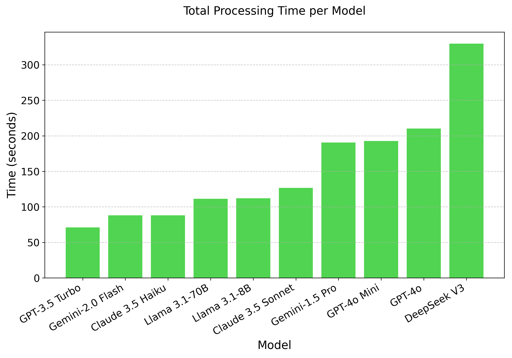
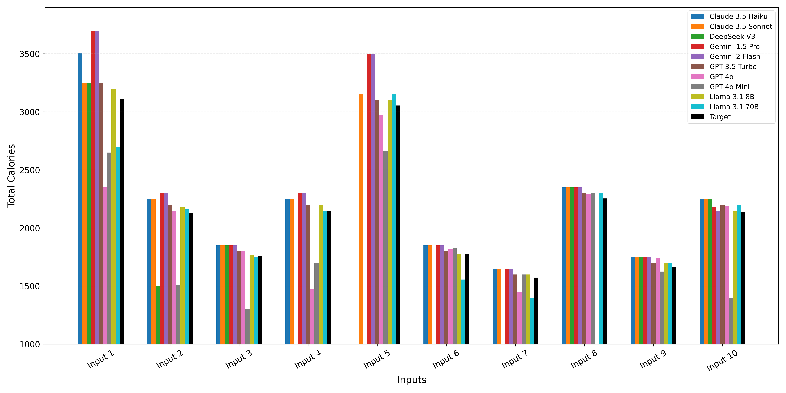

# NutriGen: Personalized Meal Plan Generator Leveraging Large Language Models to Enhance Dietary and Nutritional Adherence

Maintaining a balanced diet is essential for overall health, yet many individuals struggle with meal planning due to nutritional complexity, time constraints, and lack of dietary knowledge. Personalized food recommendations can help address these challenges by tailoring meal plans to individual preferences, habits, and dietary restrictions. However, existing dietary recommendation systems often lack adaptability, fail to consider real-world constraints such as food ingredient availability, and require extensive user input, making them impractical for sustainable and scalable daily use.

To address these limitations, we introduce **NutriGen**, a framework based on large language models (LLM) designed to generate personalized meal plans that align with user-defined dietary preferences and constraints. By building a personalized nutrition database and leveraging prompt engineering, our approach enables LLMs to incorporate reliable nutritional references like the USDA nutrition database while maintaining flexibility and ease-of-use. We demonstrate that LLMs have strong potential in generating accurate and user-friendly food recommendations, addressing key limitations in existing dietary recommendation systems by providing structured, practical, and scalable meal plans.

Our evaluation shows that **Llama 3.1 8B and GPT-3.5 Turbo achieve the lowest percentage errors of 1.55% and 3.68%, respectively**, producing meal plans that closely align with user-defined caloric targets while minimizing deviation and improving precision. Additionally, we compared the performance of **DeepSeek V3** against several established models to evaluate its potential in personalized nutrition planning. Our results showed that it struggled with accuracy, exhibiting a higher MAE of **10.45%**, and was significantly slower in processing time compared to models like **GPT-3.5 Turbo and Llama 3.1 8B**, highlighting the need for further optimization.

---

## Installation and Setup

### Requirements

This project is developed using **Python 3.10**. To install the necessary dependencies, run:

```sh
pip install -r requirements.txt
```

#### Dependencies (from `requirements.txt`):
* anthropic==0.45.2
* google.generativeai==0.8.4
* llamaapi==0.1.36
* openai==1.42.0
* numpy==2.2.2
* pandas==2.2.3

---

## Running the Code

To run the NutriGen framework and generate meal plans, execute the provided Jupyter Notebook and make sure to replace `"KEY"` with a valid API key in the code before execution.

---

## Evaluation Results

### Model Processing Time

To evaluate the computational efficiency of each model, we measured the total processing time required to generate 10 outputs. The results show significant variations in execution time across different models. 

As expected, **smaller and optimized models** such as **GPT-3.5 Turbo, Gemini 2.0 Flash, and Claude 3.5 Haiku** demonstrated the fastest processing times, completing the task in significantly less time compared to larger models.

<p align="center">
  
</p>

---

### Accuracy in Meal Plan Generation

Another valuable analysis that provides insight into how well LLMs incorporate user preferences into their generated meal plans involves comparing the average total nutrition for each input against the specified target values. The following figure illustrates the comparison between the average total calories in meal plans generated by each model and the target for each input.

<p align="center">
  
</p>

---

## Citation

If you use this work in your research, please cite:

```bibtex
@misc{khamesian2025nutrigen,
    title={NutriGen: Personalized Meal Plan Generator Leveraging Large Language Models to Enhance Dietary and Nutritional Adherence},
    author={Saman Khamesian and Asiful Arefeen and Stephanie M. Carpenter and Hassan Ghasemzadeh},
    year={2025},
    eprint={2502.20601},
    archivePrefix={arXiv},
    primaryClass={cs.AI}
}
```
